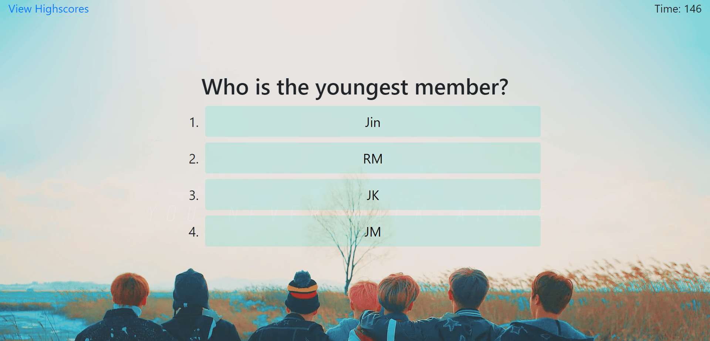
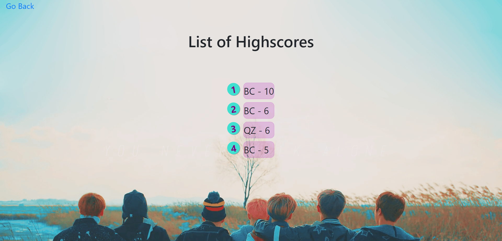

# BTS-Quiz

 

## **Description**

A fun, little quiz for users to test their knowledge about BTS. The focus of this project was to mainly use JavaScript to create the quiz, so there are minimal HTML and CSS codes. Users will be presented with instructions and a start button. Questions are displayed with their corresponding answer choices one at a time. Each question is worth 1 point and with each incorrect answer, the score will be deducted by 1 and the timer by 10 seconds. The "View Highscore" link is purposely disabled for first-time takers as there will not be any data to retrieve from the local storage yet. Either after answering all the questions or when the timer reaches 0, the game is over and users can store their initials and scores.

## Usage

After cloning the repository, if you would like to open the application locally, you need to either open the index.html file and press the short cut "Alt+B" or left click over the file and click "Open in Default Browser" to view this application.

## **Screenshots**

## **Github Page Link**

[Link to Github Page!](https://bchen41.github.io/BTS-Quiz/)

## **License**

[MIT License](https://github.com/bchen41/BTS-Quiz/blob/main/LICENSE)

Author: Betty Chen
