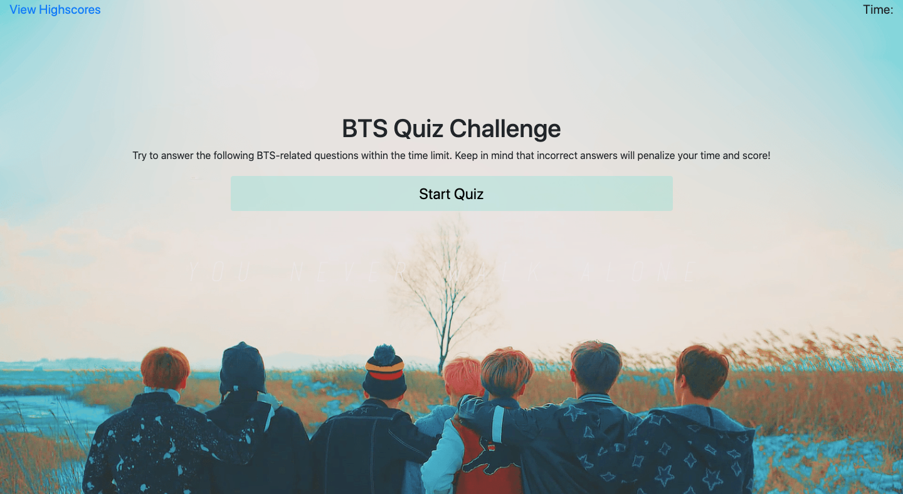

# BTS-Quiz

## **Description**

Making a quiz about BTS that stores high scores.

**HTML and CSS**

The focus of this project was to mainly use JavaScript to program the quiz so HTML and CSS has minimal codes.

**JavaScript**

This simple quiz will present details and a start button, which upon clicking will display questions with their corresponding answer choices one at a time. Each question is worth 1 point and with each incorrect answer, the score will be deducted by 1 and the timer by 10 seconds.

The "View Highscore" link is purposely disabled for first-time takers as there will not be any data to retrieve from the local storage yet.

Either after answering all the questions or when the timer reaches 0, the game is over and users can store their initials and scores.

## **Screenshot**

## **Github Page Link**

[Link to Github Page!](https://bchen41.github.io/BTS-Quiz/)

Author: Betty Chen
